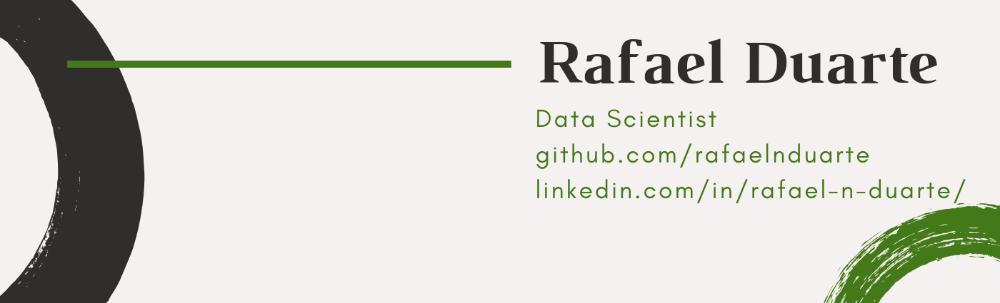

   

  

## Data Scientist and Collaborator at Sigmoidal for Data Science

Goal and detail-oriented, thorough and determined. I'm a highly motivated, responsible and reliable
professional, eager to learn and help through hard work. Experienced with working under pressure, 
comfortable with learning on-the-go, always ready to find and overcome new obstacles.  

**Background in:** Python and Machine Learning.

**Links:**
* [LinkedIn](https://www.linkedin.com/in/rafael-n-duarte/)
* [Medium](https://medium.com/@rafaelnduarte)

## Projects:

* **Credit Card Fraud Identification with Logistic Regression:**  http://bit.ly/39Fqb7m
* **Credit Card Default Prediction - Logistic Regression / Decision Tree:**  http://bit.ly/2vDveXp
* **K-Means Clustering Using Spotify Data:**  http://bit.ly/2T0crxq
* **Airbnb Data Analysis and Listing Price Prediction With XGBoost:**  http://bit.ly/2SyBTuT
* **Kaggle House Price Prediction - XGBoost:** http://bit.ly/37DalIS
* **NBB Data Analysis and Data Science Project Proposal (PT-BR):** http://bit.ly/3bQOhOD
* **Turnover Reduction with Machine Learning - HR (PT-BR):** http://bit.ly/2SOdmAU
* **Heart Disease Identification with XGBoost:** http://bit.ly/2SBOsWr
* **Kaggle - Titanic: Machine Learning From Disaster With Logistic Regression and Decision Tree:** http://bit.ly/322LVaJ

---

