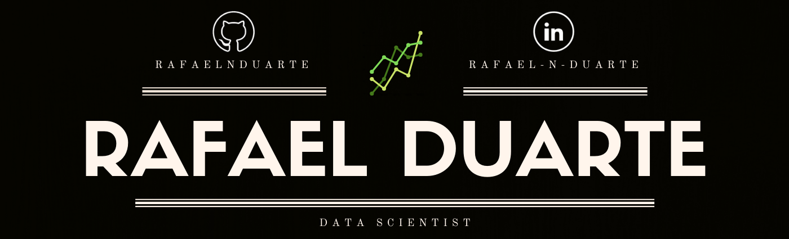

   

  

## Data Scientist and Collaborator at Sigmoidal.ai

Having been working as a Data Scientist since 2019, I've been fortunate enough to tackle exciting projects. At Sigmoidal, we have helped over 3.000 people learn Python and Data Science, which has opened several opportunities for them in some of the largest companies around the world, such as IBM, Boeing, Farfetch, as well as Brazilian behemoths such as NuBank, Itaú, Sympla, among others.

We also work with consulting on Data Science, having delivered relevant projects to companies in diverse markets in Brazil and abroad. Most of them are confidential, but I've replicated some of the solutions, using public data to develop different projects for this portfolio. I'm currently updating these projects so that even my earliest works can reflect my current abilities.

All in all, I believe my greatest asset is not being extremely technical. I'm a businessman first and a programmer second, which means I understand the big picture and can see beyond the codes and algorithms, which helps translate technical work into real-life results.

**Links:**
* [LinkedIn](https://www.linkedin.com/in/rafael-n-duarte/)
* [Medium](https://medium.com/@rafaelnduarte)
* [Sigmoidal.ai](https://sigmoidal.ai/)

## Projects:

Business

* **[Demand Forecast For a Wine Business](https://github.com/rafaelnduarte/Demand_Forecast_Wine_Business/blob/main/README.md)**

* **[RFM Customer Segmentation With K-Means](https://bit.ly/2RFTWi2)**

* **[Turnover Reduction with Machine Learning - HR (EN)](http://bit.ly/3caYK7t)**

* **[Sales Forecast With Prophet](https://bit.ly/2wHiD6l)**
 
* **[Understanding Your Customers With NLP](https://bit.ly/2XE4emg)**
 
* **[K-Means Clustering Using Spotify Data](http://bit.ly/2T0crxq)**

* **[Twitter Sentiment Analysis](https://bit.ly/2XaRpie)**
 
* **[Airbnb Data Analysis and Listing Price Prediction With XGBoost](http://bit.ly/2SyBTuT)**
 
* **[Kaggle House Price Prediction - XGBoost](http://bit.ly/37DalIS)**

* **[Image Classification using Convolutional Neural Networks](https://bit.ly/3cdckqJ)**

Banking and Finances

* **[Credit Card Fraud Identification with Logistic Regression](http://bit.ly/39Fqb7m)**
 
* **[Credit Card Default Prediction](https://github.com/rafaelnduarte/Credit_Card_Default_Prediction)**

Medicine and Healthcare

* **[Heart Disease Identification with XGBoost](http://bit.ly/2SBOsWr)**

Sports

* **[NBB Data Analysis and Data Science Project Proposal (PT-BR)](http://bit.ly/3bQOhOD)**

---

